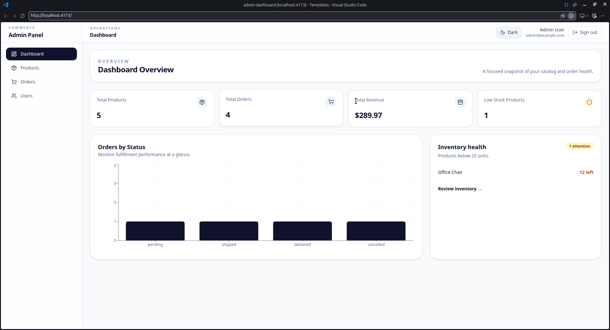
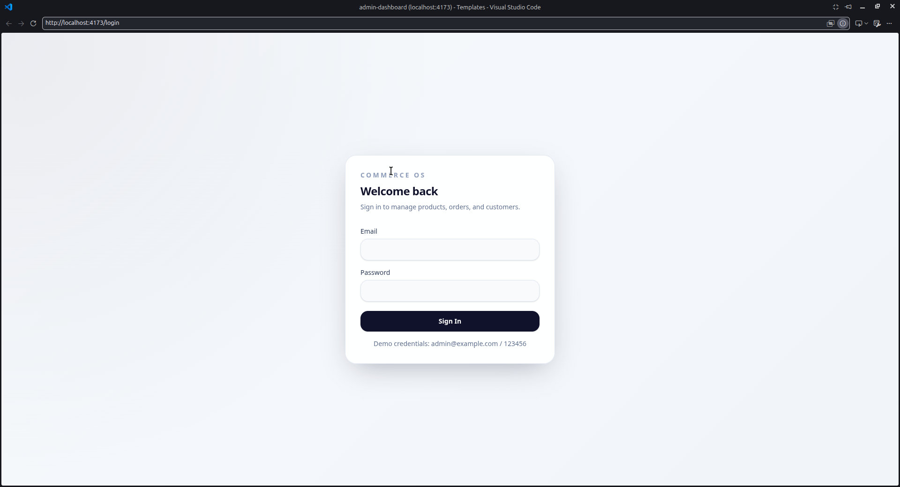
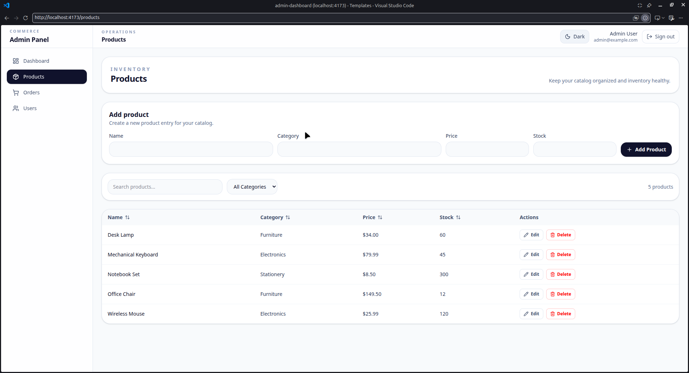
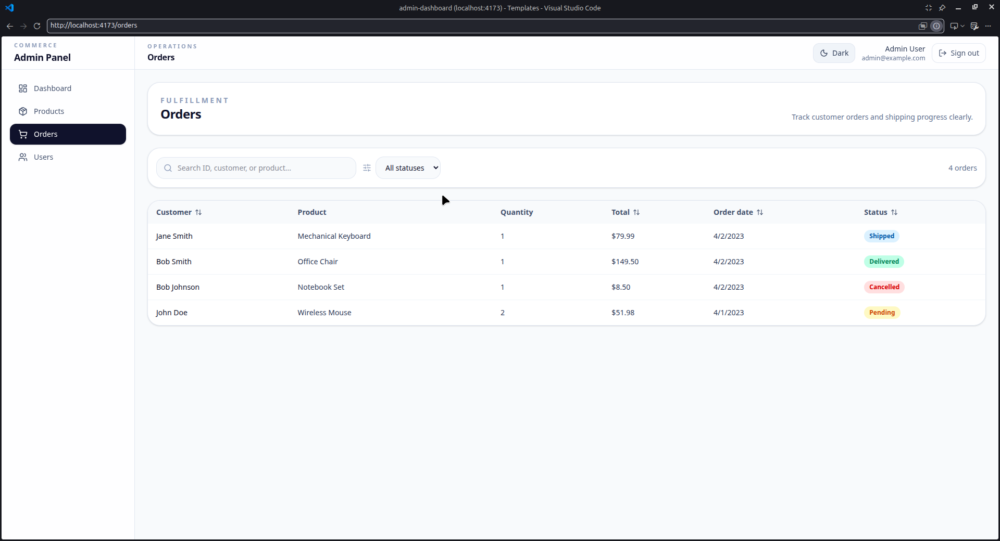
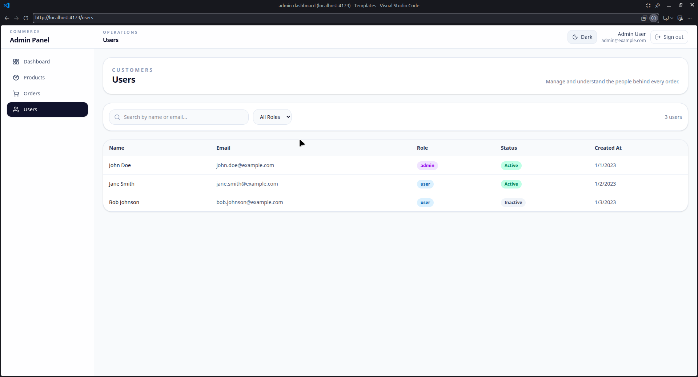

# Commerce Admin Panel

A production-minded e-commerce administration dashboard built with React, TypeScript, Vite, and Tailwind CSS.

---

## Dashboard Preview



---

## Features

✅ Authentication & Protected Routes

✅ Dashboard Analytics & KPIs

✅ Product Management (CRUD)

✅ Order Management

✅ User Directory

✅ Dark Mode

✅ Responsive Design

✅ Accessibility Support

---

## Application Screens

### Authentication

| Login |
|---------|
|  |

---

### Dashboard

| Overview |
|----------|
|  |

---

### Product Management

| Products |
|----------|
|  |

Features:

- Create Products
- Edit Products
- Delete Products
- Search
- Filtering
- Sorting
- Pagination

---

### Order Management

| Orders |
|--------|
|  |

Features:

- Search Orders
- Filter By Status
- Sort Columns
- Pagination

---

### User Management

| Users |
|--------|
|  |

Features:

- Search By Name
- Search By Email
- Filter By Role

---

## Tech Stack

| Category | Technology |
|-----------|------------|
| Frontend | React 19 |
| Language | TypeScript |
| Build Tool | Vite |
| Styling | Tailwind CSS 4 |
| Routing | React Router |
| Charts | Recharts |
| Icons | Lucide React |
| Notifications | Sonner |

---

## Architecture Highlights

- Feature-Based Architecture
- Protected Routes
- Shared Product Store (`useSyncExternalStore`)
- Lazy Loaded Routes
- Memoized Derived State (`useMemo`)
- Theme Persistence
- Accessible Components

---

## Installation

```bash
npm install
npm run dev
```

---

## Demo Credentials

```txt
Email: admin@example.com
Password: 123456
```

---

## Production Build

```bash
npm run build
npm run lint
```

---

## Future Improvements

- Real Backend Integration
- TanStack Query
- RBAC Permissions
- Unit Testing
- Integration Testing
- Analytics & Monitoring

---

## Author

**Eslam Yahya**

Frontend Developer

GitHub: https://github.com/EslamYahya
